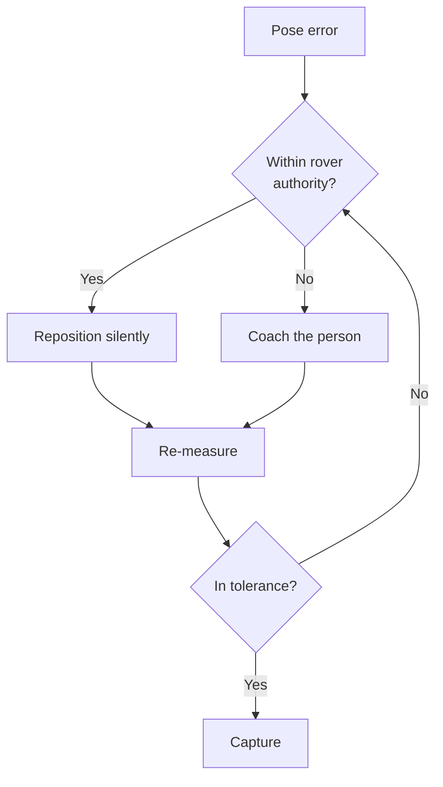
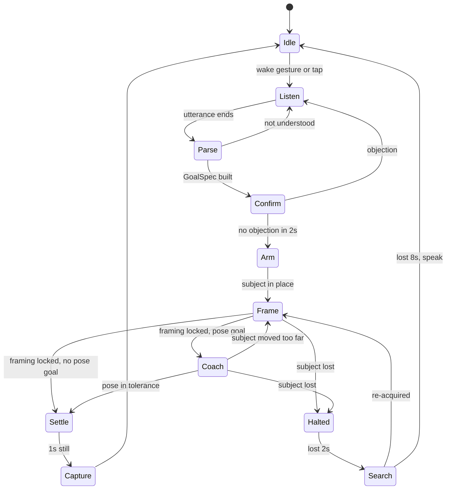

# Autonomous Framing Rover — PRD

2026-09-18 · @Someone

## Scope and deliverables

This is a build spec for the software and firmware of an autonomous framing rover: what to write, in what order, with what interfaces. Product rationale is summarised only where it constrains an implementation decision.

**The system in one sentence.** A rear-facing iPhone streams frames and motion data to a laptop, the laptop runs detection and control, and an ESP32-S3-CAM applies the resulting motor and tilt commands, so the rover positions itself to frame the subject against a chosen background object and then coaches the subject's pose before capturing.

**Three codebases**

| # | Deliverable | Language | Target | Approx. size |
| --- | --- | --- | --- | --- |
| D1 | Rover firmware | C / C++ (ESP-IDF or Arduino) | ESP32-S3-CAM | \~800 lines |
| D2 | Phone client | HTML + JavaScript, one file | Safari on iOS, served over HTTPS by D3 | \~400 lines |
| D3 | Control application | Python 3.11+ | Windows laptop | \~1500 lines |

**Design rules that bind every module**

1. **The decision layer is pure.** `decide(obs, state, config)` imports nothing but `math`. No imaging library, no I/O, no globals. This is what makes a later port to a phone-only build a two-day job instead of a two-week one.
2. **All image coordinates are normalised 0–1.** Changing resolution or camera must not invalidate a single gain.
3. **The rover never tracks its own position.** The subject is the origin; every measurement is re-taken each frame, so nothing accumulates error. There are no wheel encoders.
4. **Safety lives in firmware.** Every stop path must work with the laptop switched off.
5. **Everything tunable lives in `config.json`**, hot-reloaded. No gain is ever a literal in code.

**Out of scope for v1:** absolute navigation, moving-subject tracking, multiple subjects, rough terrain, and full-resolution photo capture. The v1 capture is a browser frame grab.

## Hardware interface contract

The firmware is written against this hardware. Each item below carries the constraint it imposes on the code.

| Part | Qty | Interface | Constraint on firmware |
| --- | --- | --- | --- |
| ESP32-S3-CAM | 1 | Wi-Fi, GPIO | Camera **not used**; do not initialise the camera driver |
| L298N motor driver | 2 | 6 logic pins each, sharable | PWM on ENA/ENB at \~1 kHz; large voltage drop |
| 28BYJ-48 stepper + ULN2003 | 1 | 4 GPIO, unipolar | No step/dir pin — firmware generates the phase sequence |
| DC gear motors | 4 | Driven in two ganged pairs | No encoders |
| VL53L1X or ultrasonic (recommended) | 1 | I²C or 2 GPIO | Read and acted on **inside** firmware |

**H-1 Pin budget.** "ESP32-S3-CAM" covers several board layouts, so the exact free pins must be read off your board's schematic before writing the pin map. Reserved on every S3: GPIO 0 / 3 / 45 / 46 (strapping), 19 / 20 (USB), 43 / 44 (UART0), 26–32 (flash), and 33–37 where octal PSRAM is fitted. The camera socket's pins are only free if no camera module is plugged in.

The firmware needs **10 GPIO**: 2 PWM, 4 direction, 4 stepper. If the board cannot spare 10, move the stepper's four lines to a PCF8574 I²C expander — the 28BYJ-48 tops out near 500 half-steps per second, well within what a 100 kHz I²C bus can drive.

**H-2 Share the control lines across both L298N boards.** Do not wire twelve pins. Each board drives one side of the rover, with its two channels wired in parallel to the two motors on that side:

| Signal | Goes to | Pins |
| --- | --- | --- |
| `PWM_L` | Board 1 ENA + ENB | 1 |
| `DIR_L_A` / `DIR_L_B` | Board 1 IN1+IN3 / IN2+IN4 | 2 |
| `PWM_R` | Board 2 ENA + ENB | 1 |
| `DIR_R_A` / `DIR_R_B` | Board 2 IN1+IN3 / IN2+IN4 | 2 |

Direction is then `(DIR_A, DIR_B)` = (1,0) forward, (0,1) reverse, (0,0) coast, (1,1) brake.

**H-3 L298N electrical facts the code must assume.** The bridge drops roughly 1.8–2 V, so from a 7.4 V pack the motors see about 5.5 V. Expect a **high deadband** — likely 25–40% duty before the wheels turn — which makes the `min_duty` calibration in H-6 mandatory rather than optional. PWM at 1 kHz on ENA/ENB via LEDC; do not run these bridges at 20 kHz. Never power the ESP32 from the L298N's onboard 5 V regulator: use a separate buck converter, with common ground and bulk capacitance at the ESP32.

**H-4 28BYJ-48 tilt: three real problems, all solved in software.**

1. **Torque.** Holding torque is roughly 34 mN·m at the output shaft. A phone and clamp at about 200 g needs only \~30 mN·m if its centre of mass sits within 1.5 cm of the tilt axis, but far more if it does not. *Requirement: the mount must be balanced on the axis; the firmware assumes it is and will not detect slip on its own.*
2. **Backlash.** The gear train has 1–2° of slop. *Requirement: always approach a target angle from the same direction. If the move is in the other direction, overshoot by `backlash_steps` and come back.*
3. **No home switch.** *Requirement: no homing routine. The phone's gravity vector is the absolute tilt reference, and the laptop closes the loop on measured pitch. Tilt is therefore commanded as a target angle and verified visually, which also absorbs any slip or missed steps.*

**H-5 Stepper numbers.** Half-step (8-phase) sequencing, 4096 half-steps per output revolution, so 0.088° per step — far finer than needed. Maximum reliable rate \~500 half-steps/s, giving about 45°/s. Coils must be de-energised 200 ms after a move completes to avoid heat and current draw; if the mount droops when released, the mount is unbalanced (see H-4.1) and must be fixed mechanically, not by holding current.

**H-6 Calibration values** the firmware and control app both read from `config.json`: `min_duty_left`, `min_duty_right`, `trim`, `pwm_freq`, `backlash_steps`, `steps_per_degree`, `range_stop_mm`.

## Repository layout and module boundaries

One repository, three targets. The dependency rule: `decide.py`, `pose.py` and `coach.py` import nothing but `math`.

```
rover/
  firmware/            D1 - ESP32-S3-CAM
    main.c             task setup, core pinning
    net.c              UDP rx/tx, sequence handling
    drive.c            L298N: duty -> PWM + direction pins
    tilt.c             28BYJ-48 phase sequencing, backlash compensation
    safety.c           watchdog, range stop, enable gate
    protocol.h         SHARED packet definitions
  client/              D2 - phone
    index.html         capture, sensors, WebSocket, speech (single file)
  app/                 D3 - laptop
    server.py          HTTPS + WebSocket server for the phone
    streams.py         newest-frame-only reader, timestamp alignment
    perceive.py        YOLO-pose, object tracking -> Observation
    decide.py          PURE: Observation + State + Config -> Command
    pose.py            PURE: pose goals and errors
    coach.py           PURE: error -> phrase, with rate limiting
    session.py         state machine
    comms.py           UDP to firmware, telemetry in
    record.py          logging
    replay.py          re-run logs through perceive/decide
    protocol.py        SHARED packet definitions, mirrors protocol.h
  config.json          all tunables, hot-reloaded
  tests/golden/        50 recorded observations + expected commands
```

Two files are duplicated on purpose: `protocol.h` and `protocol.py` must define the same packets, and both carry a version byte so a mismatch is caught at runtime rather than misread as a control bug.

**The central data structure.** `perceive.py` emits this and nothing else; every downstream module consumes only this:

```
Observation = {
  "t": float,                  # laptop clock at frame receipt
  "t_frame": float,            # phone clock when captured
  "subject": {"cx","cy","w","h","conf"} | None,
  "keypoints": {name: (x, y, conf)} | None,   # normalised 0-1
  "shoulder_px": float | None, # the distance coordinate
  "object": {"cx","cy","w","h","conf"} | None,
  "bg_flow": (dx, dy) | None,  # self-motion cue
  "gyro": {"rate_z", "pitch", "roll"},
  "lost_for": float            # seconds since subject last seen
}

Command = {"left": int, "right": int, "tilt_deg": float,
           "enable": bool, "capture": bool, "say": str | None}
```

**Why purity matters here.** These three pure modules are the only parts that take real thought to get right. Keeping them free of library calls means they can be unit-tested with plain dictionaries, replayed at 10x speed against logs, and later transliterated to JavaScript for a laptop-free build without touching the logic.

## D1 Firmware: ESP32-S3-CAM

The firmware is deliberately stupid. It applies what it is told, reports what it sees, and stops when it stops hearing. No control logic lives here.

**F-1 Tasks and timing.** FreeRTOS, with Wi-Fi pinned to core 0 and control to core 1 so a network stall cannot delay a motor update.

| Task | Core | Rate | Job |
| --- | --- | --- | --- |
| `net` | 0 | event | Receive command packets, validate CRC and sequence, update shared state |
| `drive` | 1 | 100 Hz | Apply duty to the L298N pins with ramping |
| `tilt` | 1 | 1 kHz tick | Advance one half-step toward the step target when due |
| `safety` | 1 | 100 Hz | Watchdog, range check, enable gate |
| `telemetry` | 0 | 20 Hz | Send state back to the laptop |

**F-2 `drive.c`.** Input is a signed duty per side, -1000 to +1000.

1. Apply `trim` and the side's `min_duty` so any non-zero request actually turns the wheels. This is not optional with L298N bridges: below roughly 25–40% duty, nothing moves.
2. Ramp toward the requested duty at `max_duty_per_tick` to limit current surge.
3. Set direction pins first, then PWM, and never change direction without passing through zero duty.
4. LEDC at `pwm_freq` (1 kHz default), 10-bit resolution.
5. On `enable == false`, or any safety trip, set duty 0 and both direction pins low (coast).

**F-3 `tilt.c`.** The 28BYJ-48 has no step/dir input, so the firmware generates the phase sequence itself.

1. Half-step 8-phase table across the four ULN2003 inputs.
2. Target arrives as an **angle**; convert with `steps_per_degree` and move toward it at `max_step_rate` (500 half-steps/s default).
3. **Backlash rule:** approach every target from the same direction. If the move would arrive from the other side, overshoot by `backlash_steps` and come back.
4. De-energise all four phases 200 ms after the last step.
5. Report the current step position in telemetry. It is an open-loop guess; the laptop corrects it against the phone's gravity reading.

**F-4 `safety.c`** — all three checks run regardless of what the laptop asks:

- No valid packet in 250 ms, or a sequence number that has not advanced, forces duty 0.
- Distance below `range_stop_mm` refuses positive (forward) duty, while still allowing reverse and turns.
- Supply below `vbat_min_mv` refuses all motion and raises a status bit.

**F-5 What the firmware must never do:** no framing logic, no filtering of commands beyond ramping, no retries, no reconnect backoff that delays the watchdog, and no camera initialisation.

**F-6 Bring-up order**, each step verified before the next: blink, Wi-Fi join, UDP echo, one motor on the bench, both sides, watchdog drill, stepper sweep, backlash measurement, range sensor, full packet path.

## Wire protocols

Two links, defined once each in `protocol.h` and mirrored exactly in `protocol.py`. A change to either file without the other is the most likely source of silent misbehaviour, so both carry a version byte that is checked on every packet.

**W-1 Laptop to firmware** — UDP, 14 bytes, little-endian, 20–50 Hz:

```
offset  type    field
0       uint8   version      protocol version, rejected if mismatched
1       uint8   flags        bit0 enable, bit1 tilt_release, bit2 zero_tilt
2       uint16  seq          increments; firmware ignores non-advancing
4       int16   left         -1000..1000 duty
6       int16   right        -1000..1000 duty
8       int16   tilt_deg_x10 target tilt angle, tenths of a degree
10      uint16  reserved
12      uint16  crc16        over bytes 0..11
```

**W-2 Firmware to laptop** — UDP, 16 bytes, 20 Hz:

```
0   uint8   version
1   uint8   status       bit0 enabled, bit1 range_trip, bit2 vbat_low,
                         bit3 watchdog_trip, bit4 tilt_moving
2   uint16  seq_echo     last accepted command sequence
4   int32   tilt_steps   open-loop step position
8   uint16  range_mm     0xFFFF if no sensor or no reading
10  uint16  vbat_mv
12  uint16  loop_us      worst drive-task period since last report
14  uint16  crc16
```

**W-3 Phone to laptop** — WebSocket, two message kinds on one socket:

| Kind | Rate | Payload |
| --- | --- | --- |
| Frame | 10–15 Hz | Binary: 8-byte phone timestamp, then JPEG bytes |
| Motion | 50 Hz | JSON: `{t, rate_z, pitch, roll, ax, ay, az}` |

**W-4 Laptop to phone** — WebSocket JSON: `{"say": "a bit higher"}`, `{"capture": true}`, `{"quality": 0.6}`, `{"stop": true}`.

**W-5 Rules for both links**

1. UDP, never TCP, for motor commands. A retransmitted stale command is worse than a dropped one.
2. The firmware never initiates. It answers and reports; it does not retry.
3. Sequence numbers are monotonic and wrap at 65535. The firmware rejects a non-advancing sequence, which makes a stuck sender indistinguishable from silence.
4. The laptop keeps sending at its fixed rate even when nothing changes. The packet stream *is* the heartbeat.
5. `loop_us` in telemetry is the early-warning signal: if the drive task's worst period grows, the firmware is being starved and the watchdog margin is shrinking.

## D2 Phone client

One HTML file, served by the laptop over HTTPS, opened in Safari. No app, no install, no expiry. It captures, it reports, it speaks — it decides nothing.

**C-1 Startup sequence**

1. Request camera permission with `facingMode: "environment"`, asking for the highest resolution the device will negotiate, then **read back `video.videoWidth`** — constraints fall back silently.
2. Request motion permission (`DeviceMotionEvent.requestPermission`), which must be triggered by a user tap.
3. Acquire a wake lock; show a large "running" indicator so a blanked screen is obvious.
4. Open the WebSocket and send a hello with the negotiated resolution, so the laptop can compute normalised coordinates correctly.

**C-2 Capture loop.** On a timer at `frame_hz` (10–15): draw the video element to an offscreen canvas at the working width (480 px default), `canvas.toBlob('image/jpeg', quality)`, prepend the phone timestamp, send as one binary WebSocket message. **Never queue**: if the socket's `bufferedAmount` exceeds one frame, skip this frame rather than falling behind. Dropped frames are fine; late frames are poison.

**C-3 Motion loop.** `devicemotion` and `deviceorientation` at their native rate, throttled to 50 Hz, sent as JSON with the same clock as the frames. Pitch and roll come from the gravity vector, and pitch is the tilt feedback the firmware cannot provide.

**C-4 Speech.** On `{"say": ...}`, cancel anything currently speaking and speak the new line. The phone is 3–4 m from the subject and facing them, so it is the right speaker; the laptop chooses the words.

**C-5 Capture.** On `{"capture": true}`, grab at the highest resolution available — optionally calling `applyConstraints` to raise it, waiting a few frames to settle — and POST the image back. **Known limit:** Safari has never supported the ImageCapture API, so this is a canvas grab at video resolution, typically 1080p–4K, without Apple's computational photography. Accepted for v1.

**C-6 The risk to retire first.** The page must be a secure origin for camera access, and a secure origin cannot open a plain WebSocket, so the laptop serves it over HTTPS with a self-signed certificate that Safari will warn about once. **Test this in the first hour of the build.** If Safari refuses camera access after the warning, fall back to an off-the-shelf RTSP streaming app and accept losing motion data and speech.

**C-7 Resilience.** Reconnect the socket with backoff, keep capturing while disconnected but discard rather than buffer, and display latency and frame rate on screen so problems are visible at a glance from across the room.

## D3a Perception

`streams.py` and `perceive.py` turn bytes into one `Observation` per frame. Everything here is allowed to use libraries; nothing here makes a decision.

**P-1 `streams.py` — newest-frame-only.** A reader thread receives WebSocket messages continuously and overwrites a single slot; the control loop reads that slot. Never a queue. A growing queue presents as latency that climbs slowly through a session and silently invalidates every gain tuned after it starts.

**P-2 Timestamp alignment.** Motion packets arrive in \~5 ms; frames arrive 150–250 ms late. Fusing the newest of each pairs an orientation from the present with an image from the past, which looks exactly like bad gains and will waste a day if not handled. Requirement: keep a ring buffer of motion samples and, for each frame, look up the values **at that frame's timestamp**, corrected by a clock offset measured with a ping-pong exchange at startup.

**P-3 Detection.** YOLO-pose nano at 480 input. On a CPU-only laptop, export to OpenVINO or NCNN first; a 2–3x speedup is the difference between 8 and 20 fps. Target ≥ 10 fps sustained.

**P-4 Subject measurement.** `shoulder_px` is the distance between the two shoulder keypoints, and it is the system's distance coordinate. Do **not** use bounding-box height: it changes when the subject raises their arms, which the control loop would read as 40 cm of travel.

**P-5 Object selection and tracking**, in order of cost:

1. Selection by click in the preview window (baseline), or by name resolved against numbered detections.
2. Frame-to-frame tracker (CSRT or KCF) on the selected box.
3. Re-detection every N frames, snapping the tracker to the best-matching box.
4. An appearance fingerprint saved at selection, used to re-find the object after occlusion.
5. Last-known bearing carried forward with gyro integration during a brief loss.

**P-6 Background flow.** Sparse Lucas-Kanade optical flow on a few hundred corners **outside** the subject mask, giving `bg_flow`. This is the system's only self-motion cue and it resolves the central ambiguity: background shifted and subject size changed means the rover moved; background static and subject size changed means the subject moved.

**P-7 Confidence and staleness.** Every field carries its own confidence, and `lost_for` counts seconds since the subject was last seen. Perception never substitutes a guess for a missing measurement — it emits `None` and lets the decision layer choose what to do.

## D3b Goal capture

The run's goal is fixed before the wheels turn. The user says one sentence aloud, the system turns it into a `GoalSpec`, confirms it, and only then moves.

This ordering is deliberate. The rover is stationary and silent while listening, so speech recognition is not fighting motor noise, and a misheard sentence cannot be discovered halfway through a maneuver.

**G-1 Flow.** `listen → transcribe → classify → resolve object → confirm aloud → lock`. The phone page does the recognition and sends the transcript over the WebSocket; the laptop does the parsing. **No command with `enable` set is issued until the `GoalSpec` is locked.**

**G-2 The structure**, built once per run and read-only thereafter:

```
GoalSpec = {
  "raw":           "make me point at the bird",
  "object_phrase": "the bird",
  "object_ref":    <detection id, once resolved>,
  "kind":          "framing" | "pose",
  "pose_goal":     "point_at" | "hold" | "look_at" | None,
  "limb":          "right_arm" | "left_arm" | None,
  "composition":   {subject_x, object_x, eyeline_y,
                    subject_height, size_ratio}
}
```

**G-3 Classification.** The verb decides `kind`; everything else falls through to plain framing:

| Phrase in the utterance | kind | pose\_goal |
| --- | --- | --- |
| point at, pointing at | pose | `point_at` |
| hold, holding, touch, touching, pinch | pose | `hold` |
| look at, looking at, facing | pose | `look_at` |
| next to, beside, in front of, behind me, with | framing | — |
| a bare object with no verb | framing | — |

So "make me point at the bird" becomes a pose run with `point_at`, and "frame me next to the big tree" becomes a framing run. **Framing defaults:** rule of thirds, subject on the third opposite the object, eyeline on the upper third, subject at 50% of frame height. The user only ever states a default to override it.

**G-4 Side and limb.** For a framing run, the object's current position in frame decides which third the subject takes — subject opposite object. For a pose run, an explicit limb ("with your left hand") wins; otherwise choose the arm on the same side as the object, since pointing across the body reads badly and foreshortens.

**G-5 Two-tier parser.**

1. **Tier 1, local.** A keyword and preposition grammar covering the table above. Deterministic, offline, instant. It must handle every phrase in G-3 without network access.
2. **Tier 2, cloud fallback.** Anything tier 1 cannot classify above `parse_confidence` goes to a language model that returns the same JSON schema. Its output is validated against the schema and rejected if it names a goal that does not exist. A run never blocks on the network: if tier 2 is unreachable, the system asks once and then falls back to framing.

**G-6 Object resolution.** The noun phrase is matched against current detections by drawing numbered boxes and asking which number, with ties broken by size and centrality. If nothing matches — "bird" with no bird in view — the rover says so and offers a tap instead. Resolution happens before confirmation, so the confirmation is about a thing the rover can actually see.

**G-7 Confirmation.** The rover speaks the parsed goal back in its own words — "Pointing at the bird, you on the left third. Starting." — and waits `confirm_window` (2 s) for an objection. A wrong parse must cost two seconds, not a whole run.

**G-8 Failure ladder.** Not understood → ask once. Still not understood → plain framing on the largest confident detection, announced. No usable object → stay in `Idle` and say why. The rover never guesses silently.

**G-9 Logging.** Every run logs the raw transcript, which tier parsed it, the resulting `GoalSpec` and whether the user objected. This is the only way to measure parse quality offline and improve the tier-1 grammar over time.

## D3c Decision: framing control

`decide.py` is a pure function. Given an `Observation`, the session `State` and the `Config`, it returns a `Command`. No I/O, no libraries, no hidden state.

**D-1 Four axes, four errors.** Each axis controls one framing quantity, and they are treated as independent:

| Axis | Error | Output |
| --- | --- | --- |
| Yaw | Midpoint of subject and object vs target x | Differential duty |
| Distance | Size ratio vs target ratio | Common duty |
| Tilt | Subject eyeline vs target y | Tilt angle |
| Scale | Subject height vs target fraction | Crop at capture |

**D-2 The control law**, identical in shape on every axis:

```
err = (measured - target)          # normalised, -1..1
if abs(err) < deadband: cmd = 0
else: cmd = clamp(kp * err, -max_cmd, max_cmd)
cmd = apply_min_duty(cmd, min_duty)   # L298N needs this
cmd = rate_limit(cmd, prev_cmd, max_delta)
```

Minimum-duty compensation is a requirement, not a refinement: below roughly 25–40% duty an L298N bridge turns nothing, so a small proportional output would otherwise be silently discarded and the loop would appear dead near its target.

**D-3 Yaw uses the gyro.** Vision at 10–15 Hz is too slow to close a turn without overshoot. Inner loop: commanded yaw rate against the gyro at 50 Hz. Outer loop: vision correcting the target yaw rate. Turns are also expressed as "rotate N degrees" by integrating gyro rate, which is more repeatable than timing a duty.

**D-4 The distance coordinate is `shoulder_px`**, never metres. It is re-measured absolutely each frame and cannot drift. If a metric figure is needed for limits, one calibration of the subject's real shoulder width gives distance by similar triangles to about ±10%.

**D-5 The sweep.** To find the distance satisfying the size ratio: drive slowly through the usable range logging `(shoulder_px, ratio)`, fit a monotonic curve, solve for the target ratio, drive back to that `shoulder_px`, re-check once. Fitting a curve through many noisy samples beats chasing a noisy instantaneous error.

**D-6 Self-motion gate.** Before acting on a change in `shoulder_px`, check `bg_flow`. If the background did not move, the subject did — do not react; hold and re-plan.

**D-7 Feasibility.** Turning cannot change the spacing between subject and object; only driving can, within a limited range. When the requested composition is unreachable, `decide` must return a `say` string proposing the fix ("step one metre to your left") rather than continuing to search.

**D-8 Speed limits.** 0.2 m/s equivalent while framing, 0.1 m/s when `range_mm` is under 1000, and a full stop before any measurement used for a final decision.

**D-9 Tilt is closed-loop in software.** The firmware's step count is an open-loop guess. `decide` compares the phone's measured pitch against the target and issues a corrected angle, which absorbs backlash, missed steps and any slip in the 28BYJ-48 gear train.

## D3d Pose-directed framing

`pose.py` is pure: keypoints plus an object position in, a signed error and a suggested remedy out. The detector already returns 17 keypoints in the pass that finds the person, so the added compute cost is effectively zero — this module is geometry, not perception.

**PG-1 Goal table.** Each goal is a function `(keypoints, object) -> (error, unit)`:

| Goal id | Measured as | Tolerance |
| --- | --- | --- |
| `point_at` | Elbow-to-wrist ray vs elbow-to-object direction | ±3° |
| `hold` | Wrist keypoint distance to object centre | ±2% frame width |
| `look_at` | Nose and eye keypoints vs head-to-object direction | ±8° |
| `beside` | Body centre vs object centre, correct side | ±3% frame width |
| `arms_out`, `arms_down`, `hands_hips` | Joint angles against a template | ±10° |
| `no_overlap` | Subject box vs object box intersection | 0 |

**PG-2 The pointing computation.**

```latex
\theta_{\text{arm}} = \operatorname{atan2}(w_y - e_y,\; w_x - e_x)
```

```latex
\theta_{\text{target}} = \operatorname{atan2}(o_y - e_y,\; o_x - e_x)
```

with *w* the wrist keypoint, *e* the elbow, *o* the object centre. The signed wrapped difference is the error: positive means raise the hand.

**PG-3 Foreshortening guard.** The computation aligns the arm with the object *in the image*, which is exactly right for a 2D photograph, but an arm angled toward or away from the camera projects to a misleading angle. Requirement: if forearm length in pixels falls below `foreshorten_ratio` (0.7 default) of its expected value relative to `shoulder_px`, return the remedy `turn_side_on` instead of an angle correction.

**PG-4 Rover-first remedy policy.** Every error returns a remedy of `rover` or `person`. Small misalignments can be absorbed by driving, because moving sideways or changing distance shifts the object relative to the subject through parallax; large ones cannot.



This is a product requirement, not an optimisation. A system that asks the person to move when it could have driven 20 cm feels bossy; one that quietly repositions feels intelligent.

**PG-5 Sequencing.** Rover positioning and subject coaching must never run at the same time — two coupled loops chasing each other oscillate. The order is fixed: **frame → lock position → coach → capture**, with at most one return to framing if the subject's movement invalidated it.

**PG-6 Where the goal comes from.** The pose goal is not chosen here — it arrives in the locked `GoalSpec` from D3b, parsed from what the user said before any movement. This module only measures error against a goal already fixed. Later additions that fit the same structure: a reference photo matched on normalised joint angles, and free-form phrasings resolved by the tier-2 parser.

## D3e Coaching and session state

`coach.py` turns a pose error into words; `session.py` decides which phase the system is in. Whether the pose feature is liked or switched off is decided entirely here, not by measurement accuracy.

**CO-1 Error to phrase.**

| Error | Phrase |
| --- | --- |
| > 20° | "Raise your arm a lot" |
| 8–20° | "A bit higher" |
| 3–8° | "Almost — tiny bit up" |
| < 3° | "Hold it" then countdown |

**CO-2 Speaking rules — all required.**

1. One instruction at a time. Fix the largest error, re-evaluate, speak again. Never compound.
2. At most one utterance per `min_speak_interval` (1.5–2 s). Faster is unusable.
3. Hysteresis: once inside tolerance, widen the zone before speaking again, or the subject hears "up... down... up..." indefinitely.
4. **Directions from the subject's perspective.** The phone faces them, so their left is image-right. This is the most common bug in this class of feature and it destroys trust on the first run. It gets its own test case.
5. Countdown for the final hold: "Hold — three, two, one."
6. Capture a burst of 5–10 frames in tolerance, pick the sharpest with the best pose score.
7. Give up at `coach_timeout` (\~20 s): take the best frame achieved and say so. An endless correction loop is worse than an imperfect photo.
8. A cue must reflect a measurement no more than 500 ms old, or the subject corrects against stale information.

**CO-3 Session state machine.**



Motors are inhibited in `Idle`, `Listen`, `Parse` and `Confirm`: the `GoalSpec` is locked before the first command that sets `enable`. `Coach` is entered only when the locked goal has `kind == "pose"`; a framing run goes straight from `Frame` to `Settle`. Every state carries a timeout and every timeout has a defined exit — there is no state whose only escape is a human touching the rover.

**CO-4 Anchor loss is a first-class state.** The subject is the only positional reference, so losing them means losing all sense of place. `Halted` stops the motors within 500 ms. `Search` is a slow gyro-guided spin toward the last known bearing, capped at ±60°. The rover must never drive while it cannot see the subject.

**CO-5 Start and abort.** A run starts when the subject wakes the rover — a raised hand held one second, or a tap before walking away — and then says what they want. Nothing else is needed, and nothing is touched. A spoken or gestured cancel returns to `Idle` and zeroes the motors from any state, including mid-manoeuvre.

## Configuration, logging and replay

No gain is ever a literal in code, and every run is reproducible at a desk.

**CF-1 `config.json`**, hot-reloaded on change, read identically by the control app and flashed into the firmware's defaults:

```json
{
  "hardware": {
    "pwm_freq": 1000, "min_duty_left": 320, "min_duty_right": 330,
    "trim": -0.03, "max_duty": 650, "max_duty_per_tick": 40,
    "steps_per_degree": 11.4, "backlash_steps": 24,
    "max_step_rate": 500, "range_stop_mm": 350, "vbat_min_mv": 6600
  },
  "camera": { "hfov_deg": 66.0, "frame_hz": 12, "work_width": 480 },
  "control": {
    "yaw":  {"kp": 1.8, "deadband": 0.02, "max_cmd": 0.5},
    "dist": {"kp": 1.2, "deadband": 0.03, "max_cmd": 0.4},
    "tilt": {"kp": 0.8, "deadband": 0.5}
  },
  "goal": {
    "wake_gesture_hold_s": 1.0, "listen_timeout_s": 8.0,
    "parse_confidence": 0.75, "confirm_window": 2.0,
    "tier2_enabled": true, "tier2_timeout_s": 5.0
  },
  "composition_defaults": {
    "subject_x": 0.333, "object_x": 0.667,
    "eyeline_y": 0.333, "subject_height": 0.5, "size_ratio": 2.4
  },
  "pose": { "tol_deg": 3.0, "foreshorten_ratio": 0.7 },
  "coach": { "min_speak_interval": 1.8, "coach_timeout": 20.0,
             "hysteresis": 1.6 },
  "safety": { "watchdog_ms": 250, "lost_halt_s": 0.5,
              "lost_search_s": 2.0, "lost_give_up_s": 8.0 }
}
```

`composition_defaults` are exactly that: the rule-of-thirds values a framing run uses unless the spoken sentence overrides one. `pose.goal` is absent by design — the goal is never configured, it is parsed per run into the `GoalSpec`.

**CF-2 Calibration values and how each is obtained**

| Value | Method |
| --- | --- |
| `hfov_deg` | Tape measure across the view at a known distance |
| `min_duty_left/right` | Ramp duty until each side's wheels just turn |
| `trim` | Drive straight on a flat floor, measure the curve, store the offset |
| `steps_per_degree` | Command 1000 steps, measure the angle change from the phone's pitch |
| `backlash_steps` | Reverse direction and count steps until motion begins |
| `size_ratio` | Read off a reference photo the user likes |

**LG-1 Log everything, one clock.** Frames as JPEG with timestamps, every `Observation`, every `Command`, all telemetry, state transitions, spoken lines, and the active config hash. Written on the laptop at receipt, with the phone's own frame timestamp carried alongside.

**LG-2 `replay.py`.** Feeds a recorded log back through the same `perceive` and `decide` code at up to 10x speed with no hardware attached. Built during the video-pipeline milestone, not at the end. Built early it accelerates every later milestone; built late it is never built at all.

**LG-3 Golden tests.** `tests/golden/` holds 50 recorded observations with the command produced for each. Any refactor, re-tune or future port to JavaScript must reproduce them. A mismatch is then a code bug found at a desk instead of a mystery found in a field.

**LG-4 Dry-run mode.** The full pipeline runs with motor output forced to zero, printing what it would have sent. Every new behaviour is tested this way, then with wheels off the ground, before it drives.

## Test plan and build order

Each milestone is a working system, and each has a test that produces a number.

| # | Build | Done when | Hours |
| --- | --- | --- | --- |
| M1 | `firmware/` bring-up | One side drives on the bench from a 10-line Python sender | 2 |
| M2 | Watchdog and safety | Disabling Wi-Fi stops the motors in under 250 ms, verified on video | 1 |
| M3 | `tilt.c` | Commanded angles reached; `backlash_steps` measured and stored | 1.5 |
| M4 | `client/index.html` + `server.py` | Frames and motion arriving; latency under 250 ms and flat over 5 min | 2 |
| M5 | `perceive.py` | YOLO-pose at 10+ fps, `shoulder_px` stable while arms move | 1.5 |
| M6 | Calibration | Every value in CF-2 measured and in `config.json` | 2 |
| M7 | `record.py` + `replay.py` | A logged run re-runs at 10x with identical output | 1 |
| M8 | Teleop | Keyboard driving; all three safety drills pass | 1 |
| M9 | `decide.py` yaw | Subject held on the target line as they walk sideways | 2 |
| M10 | Tilt loop | Eyeline held on the upper third through pitch changes | 0.5 |
| M11 | Object tracking | Object stays locked through an occlusion | 2 |
| M12 | Sweep and spacing | Same composition from several start distances | 3 |
| M13 | `session.py` | One trigger produces a framed photo, unattended | 2 |
| M14 | `pose.py` | Pointing shot converges to ±3° and captures | 4 |
| M15 | `coach.py` polish | Transcript of 10 sessions shows no oscillation, correct left/right | 2 |

**Weekend one:** M1–M13, a rover that frames and shoots. **Weekend two:** M14–M15 plus tuning — the pose feature and the interaction polish that makes it pleasant.

**Unit tests** (no hardware, run on every change): CRC and packet round-trip in both languages against the same fixtures; `apply_min_duty` and `rate_limit` edge cases; backlash compensation reaching the same angle from both directions; every pose goal at known angles, including the mirrored left/right case; coach rate-limiting and hysteresis under a synthetic error sequence.

**Hardware drills**, repeated whenever the firmware changes:

| Drill | Pass |
| --- | --- |
| Disable laptop Wi-Fi mid-drive | Motors stop < 250 ms |
| Hand over the distance sensor at full forward | Forward refused, reverse still allowed |
| Kill the Python process | Motors stop |
| Subject steps out of frame | Halt < 500 ms, then search, then give up and speak |
| Battery run down to `vbat_min_mv` | Motion refused, status bit set |

**Working rules**

1. Wheels off the ground for the first test of any new logic.
2. Dry-run mode before energising.
3. One variable per tuning run, logged.
4. Never move fast; 0.2 m/s removes a surprising number of problems.
5. Calibrate before tuning — most "bad gains" are a wrong `hfov_deg` or an unmeasured `min_duty`.

**Deferred:** native capture for full-resolution photos, an on-rover compute board to remove the laptop, UWB ranging to the subject, and reference-photo pose matching.
